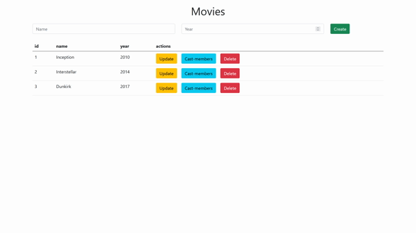

<br />
<p align="center">

  <h3 align="center">A MirageJS Test</h3>

  <p align="center">
    This is the code that I built to understand the MirageJS
    <br />
    <br />
    
  </p>
</p>

<details open="open">
  <summary>Table of Contents</summary>
  <ol>
    <li><a href="#about">About</a></li>
    <li><a href="#prerequisites">Prerequisites</a></li>
    <li><a href="#running">Running</a></li>
    <li><a href="#contact">Contact</a></li>
  </ol>
</details>

## About
I built a CRUD (Create, Read, Update and Delete) with MirageJS, I also used Bootstrap to make it organized without having to worry about writing the CSS myself.

## Prerequisites
To run in Windows 10 you need to install some tools, like: NodeJS, Chocolatey and more. [here](https://github.com/MestreALMO/React-Requires-To-Run-Windows-) is how to install all of it.
<br/>


## Running
Access the root of the project with a terminal, don't forget to run ```yarn``` if it is the first time running the project, then run the code:
```
yarn start
```
With that the app will be running! 
<br />You can access it with ```http://localhost:3000/```

## Contact
My Name: André Lusegardis Miranda de Oliveira
  * lusegardis@gmail.com
  * [LinkedIn](https://www.linkedin.com/in/andr%C3%A9-lusegardis/detail/recent-activity/shares/)
  * [GitHub](https://github.com/MestreALMO)
